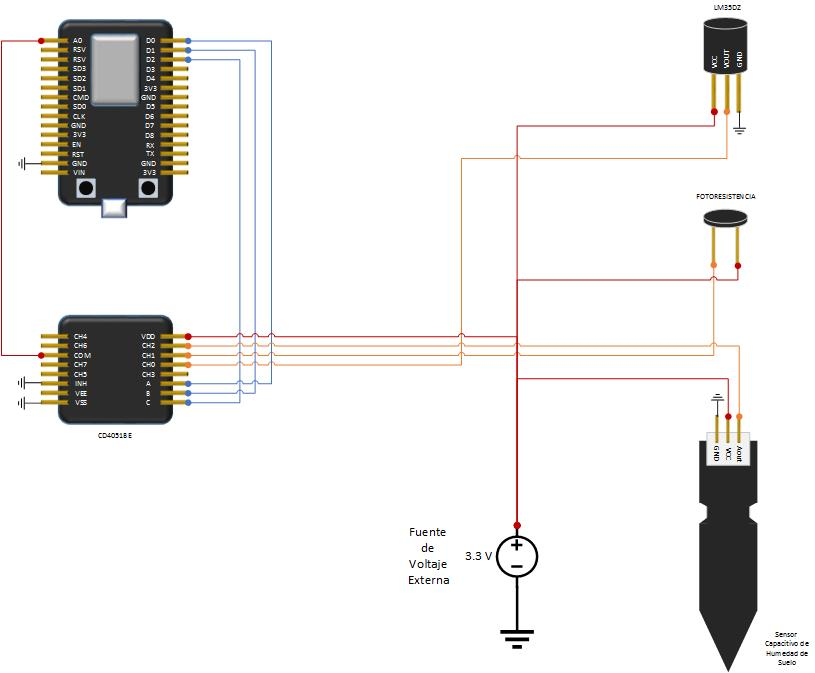

#***Monitoreo de Cultivos***
============
Desarrolladores:
- **César Villarreal** 
- **Alexis Velázquez**
- **Alejandro Mora**

##**Hardware Utilizado:**
 1. Microcontrolador Node MCU
 2. Multiplexor CMOS de 8 canales CD4051BE
 3. Sensor de Temperatura LM35
 4. Fotoresistencia
 5. Sensor de humedad de suelo capacitivo

##Diagrama Esquemático

